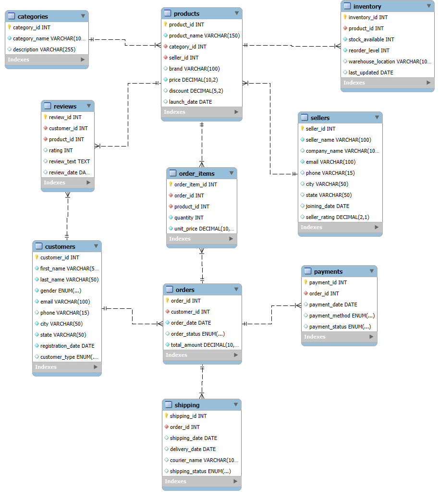

<div align="center">

# 🛒 CartMetrics SQL Analytics

### MySQL-Based E-Commerce Database & Business Analytics Project

A complete SQL project that simulates a real-world e-commerce platform using MySQL. The project covers database design, relational modeling, advanced SQL queries, business analysis, views, stored procedures, triggers, and indexes.

</div>

---

# Project Overview

CartMetrics is a MySQL-based E-Commerce SQL Analytics project developed to demonstrate real-world database design and SQL analysis.

The project includes a fully normalized relational database with realistic datasets, advanced SQL concepts, and business analysis queries that answer practical business questions such as sales trends, customer behavior, inventory status, payment analysis, and seller performance.

---

# Features

- Relational Database Design
- Normalized Database Schema
- Realistic E-Commerce Dataset
- 18,000+ Records
- Basic to Advanced SQL Queries
- Business Analysis Queries
- Views
- Stored Procedures
- Triggers
- Indexes
- Entity Relationship (ER) Diagram

---

# Tech Stack

| Technology | Usage |
|------------|-------|
| MySQL 8.0 | Database |
| SQL | Query Language |
| MySQL Workbench | Database Design & Development |
| Git | Version Control |
| GitHub | Project Hosting |

---

# Database Tables

| Table | Description |
|--------|-------------|
| Customers | Customer information |
| Sellers | Seller details |
| Categories | Product categories |
| Products | Product information |
| Inventory | Product stock management |
| Orders | Customer orders |
| Order_Items | Products within each order |
| Payments | Payment information |
| Shipping | Shipping details |
| Reviews | Customer reviews |

---

# Dataset Summary

| Table | Records |
|--------|---------|
| Customers | 500 |
| Sellers | 50 |
| Categories | 20 |
| Products | 300 |
| Inventory | 300 |
| Orders | 3000 |
| Order Items | 7000+ |
| Payments | 3000 |
| Shipping | 3000 |
| Reviews | 1500 |

### Total Dataset Size

**18,000+ Records**

---

# SQL Concepts Covered

### Database Design

- CREATE DATABASE
- CREATE TABLE
- Constraints
- Primary Keys
- Foreign Keys
- Normalization

### Basic SQL

- SELECT
- WHERE
- ORDER BY
- GROUP BY
- HAVING
- LIMIT

### Intermediate SQL

- INNER JOIN
- LEFT JOIN
- RIGHT JOIN
- Aggregate Functions
- CASE Statements

### Advanced SQL

- Subqueries
- Common Table Expressions (CTEs)
- Window Functions
- Ranking Functions

### Database Programming

- Views
- Stored Procedures
- Triggers
- Indexes

---

# Business Analysis

The project answers important business questions including:

- Top Selling Products
- Top Customers by Spending
- Monthly Revenue Analysis
- Revenue by Category
- Seller Performance
- Inventory Analysis
- Product Rating Analysis
- Payment Method Analysis
- Shipping Performance
- Order Status Analysis

---

# Project Structure

```text
CartMetrics-SQL-Analytics
│
├── Dataset
│   ├── customers.csv
│   ├── sellers_50.csv
│   ├── categories_20.csv
│   ├── products_300.csv
│   ├── inventory_300.csv
│   ├── orders_3000.csv
│   ├── order_items.csv
│   ├── payments_3000.csv
│   ├── shipping_3000.csv
│   └── reviews_1500.csv
│
├── SQL_Scripts
│   ├── 01_Database_Schema.sql
│   ├── 02_Basic_Queries.sql
│   ├── 03_Intermediate_Queries.sql
│   ├── 04_Advanced_Queries.sql
│   ├── 05_Business_Analysis.sql
│   ├── 06_Views.sql
│   ├── 07_Stored_Procedures.sql
│   ├── 08_Triggers.sql
│   └── 09_Indexes.sql
│
├── ER_Diagram
│   ├── CartMetrics_ER_Diagram.png
│   └── CartMetrics.mwb
│
└── README.md
```

---

# Entity Relationship Diagram

<p align="center">
  
</p>

---

# Learning Outcomes

This project helped strengthen practical knowledge of:

- Relational Database Design
- SQL Query Writing
- Joins
- Aggregation
- Window Functions
- Business Analysis
- Database Programming
- Query Optimization

